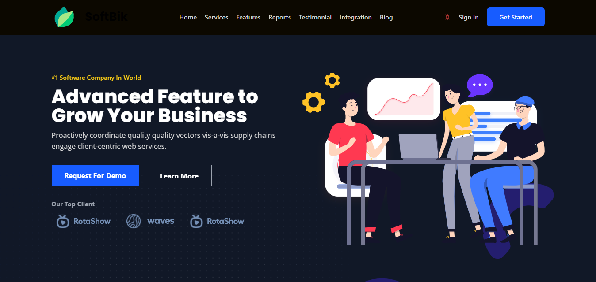

# IT Solutions & Services

Welcome to SoftBik - IT Solutions & Services! SoftBik project targets businesses of all sizes and individuals who require IT solutions and services to improve their operational efficiency and productivity. The project aims to provide customized solutions to meet the specific needs of each client and to help them achieve their goals.

## The application is live and can be accessed here
https://paiditservice.netlify.app/

## Getting Started
To get started with IT Solutions & Services, follow these steps:

## Clone the repository to your local machine: 
* git clone https://github.com/mdimtias/It-solutions-and-services-next.js
* Install any necessary dependencies: npm install
* Start the development server: npm start
* Open http://localhost:3000 in your browser to view the app.

## Technologies Used

* Next.js
* React
* Swiper
* Aos

## Contact Us

If you have any questions about web development services, or if you're interested in working with us on a project, please don't hesitate to contact us at imtias.contact@gmail.com.

